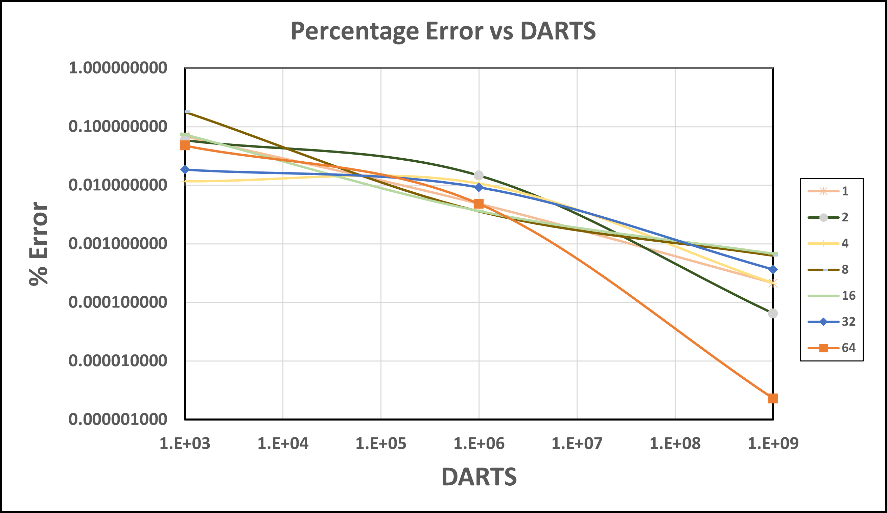

# Part 1 

## 1.1
1. The provided code fragment utilizes the variable i in both sequential and parallel loops without clearly defining its scope. Within OpenMP, a loop's variable automatically becomes private to each thread when used in parallel execution. Nonetheless, if i is defined outside the scope of the parallel region—as suggested by the code excerpt—this may result in conflicting data access
2. The snippet immediately employs the #pragma omp parallel for construct without confirming that the a, b, and c variables are initialized and ready for use in the parallel section.

## 1.2
**False Sharing**: False sharing occurs when multiple threads on different processors modify variables that reside on the same cache line, even though they are not actually sharing any data. Cache lines are the smallest unit of memory that can be transferred between the main memory and the cache. When one thread modifies a variable, the cache line containing that variable is marked as dirty, prompting an update across all caches to maintain coherence. If another thread modifies a different variable that happens to be on the same cache line, it causes the cache line to be invalidated and reloaded, even though the two variables are unrelated.

In the case of a chunk size of 1, adjacent iterations of the loop, which are likely modifying adjacent elements of array a, are distributed across different threads. If elements of a are stored in contiguous memory locations (which is typically the case), iterations assigned to different threads will often work on elements of a that reside on the same cache line. This will result in severe performance drop.

A good strategy is to let OpenMP determine it by setting a **dynamic** value.

These are highly relevant to MPI grammar, so first do section 3 & 4.

## 1.3

## 1.4

## 1.5


## 1.6 


# Part 2

# Part 3

## 3.1 Solution

Done!

## 3.2 Solution 

Done!

## 3.3 Solution

Every processors loads and runs the binary. Therefore even without including MPI library we get 4 exections of the code. 

## 3.4 Solution

We see 12 total "Hello, World!" (when we feed in 4 ranks). The "Hello, World" before and after the MPI rin in serial on every processor so should each be output 4 times fora total of 8. And since we do not limit the output for the one in the middle it should also be output 4 times, for a total of 12.   

## 3.5 Solution

### Exercise 2.3

Check **ppbook.c**

TBD: run on hpcc

### Exercise 2.4

Check **ppbook.c**

Will output
```
Process 0 on czk123.dhcp.egr.msu.edu out of 4
Process 2 on czk123.dhcp.egr.msu.edu out of 4
Process 1 on czk123.dhcp.egr.msu.edu out of 4
Process 3 on czk123.dhcp.egr.msu.edu out of 4
```

### Exercise 2.5

Check **zerop.c**

Will output
```
Process 0 on czk123.dhcp.egr.msu.edu out of 4
```

# Part 4

## 4.1 Solution

We are able to run the file and get digits for pi.  

## 4.2 Solution 

### 1 Rank: 
    0.0288078 seconds 
    
### 2 Ranks: 
    0.0273271 seconds
    0.0272933 seconds
    
### 3 Ranks: 
    0.0275971
    0.0276003
    0.0275888
    
### 4 Ranks: 
    0.0273617
    0.0274038
    0.027383
    0.0273332
    
Regardless of how many ranks we have the total runtime of the program is about ~ 0.027 seconds. However, each rank takes 0.27 seconds so as we had more ranks we are not adding any "wall_clock" time but we are adding to the computational time. 

## 4.3 Solution 
We have used MPI_REDUCE to sum all the averages from each rank (and divided by total ranks to get the final average). See [ser_pi_calc_43.cpp](./ser_pi_calc_43.cpp) for code. 

For size 1, max elapsed time is 0.026849.

For size 2, max elapsed time: 0.013629.

For size 3, max elapsed time: 0.009136.

For size 4, max elapsed time: 0.007189.

Since the ROUNDS are being divided further and further in each rank while each rank runs parallel, the run time is decreasing with increase in the number of processes. However, this decrease is not linear.

## 4.4 Solution
Number of darts and ranks were changed while keeping track of pi and runtimes. 

### Computed values of pi
|    | 1.00E+03    | 1.00E+06    | 1.00E+09    |
| -- | ----------- | ----------- | ----------- |
| 1  | 3.143760000 | 3.141744840 | 3.141590588 |
| 2  | 3.143440000 | 3.142053600 | 3.141594685 |
| 4  | 3.141960000 | 3.141928240 | 3.141585937 |
| 8  | 3.147217949 | 3.141479949 | 3.141572884 |
| 16 | 3.139291667 | 3.141478571 | 3.141571213 |
| 32 | 3.142177083 | 3.141581157 | 3.141581157 |
| 64 | 3.140093750 | 3.141592581 | 3.141592581 |

### Runtimes for each
|    | 1.00E+03 | 1.00E+06 | 1.00E+09    |
| -- | -------- | -------- | ----------- |
| 1  | 0.002915 | 4.594947 | 3844.827927 |
| 2  | 0.001496 | 2.070552 | 1975.497270 |
| 4  | 0.000806 | 1.230456 | 1048.335238 |
| 8  | 0.000526 | 0.565957 | 551.328802  |
| 16 | 0.000400 | 0.327240 | 304.160492  |
| 32 | 0.000176 | 0.106617 | 171.271397  |
| 64 | 0.000097 | 0.097750 | 63.154963   |

## 4.5 Solution
See figure below for the log-log scaled plot for percentage errors vs DARTS.


## 4.6 Solution
See figure below for the plot for time vs cores.


See figure below for the semilog-plot for time vs cores along with the ideal line.


