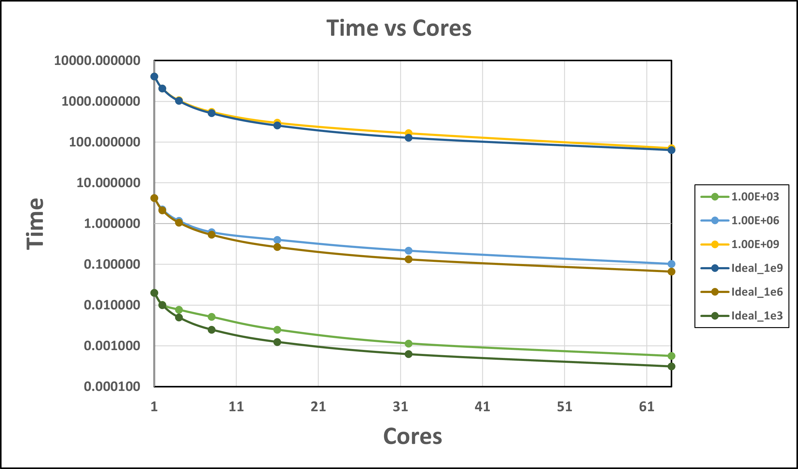

# Part 1 

## 1.1

Exercise 2.18: 

1. The provided code fragment utilizes the variable i in both sequential and parallel loops without clearly defining its scope. Within OpenMP, a loop's variable automatically becomes private to each thread when used in parallel execution. Nonetheless, if i is defined outside the scope of the parallel region—as suggested by the code excerpt—this may result in conflicting data access
2. The snippet immediately employs the #pragma omp parallel for construct without confirming that the a, b, and c variables are initialized and ready for use in the parallel section.

## 1.2

Exercise 2.19: 

**False Sharing**: False sharing occurs when multiple threads on different processors modify variables that reside on the same cache line, even though they are not actually sharing any data. Cache lines are the smallest unit of memory that can be transferred between the main memory and the cache. When one thread modifies a variable, the cache line containing that variable is marked as dirty, prompting an update across all caches to maintain coherence. If another thread modifies a different variable that happens to be on the same cache line, it causes the cache line to be invalidated and reloaded, even though the two variables are unrelated.

In the case of a chunk size of 1, adjacent iterations of the loop, which are likely modifying adjacent elements of array a, are distributed across different threads. If elements of a are stored in contiguous memory locations (which is typically the case), iterations assigned to different threads will often work on elements of a that reside on the same cache line. This will result in severe performance drop.

A good strategy is to let OpenMP determine it by setting a **dynamic** value.

These are highly relevant to MPI grammar, so first do section 3 & 4.

## 1.3

Exercise 2.21: 

We need to check now if we are on the edge of the whole system and perform the edge cases laid out on the previous page of the the textbook  

```
    MPI_Comm_rank(MPI_COMM_WORLD,&myTaskID);
    MPI_Comm_size(MPI_COMM_WORLD,&nTasks);

    if (myTaskID==0){
        leftproc = MPI_PROC_NULL;
        a[0] = (b[0]+b[i])/2
    }
    else{
        leftproc = myTaskID-1;
    }

    if (myTaskID==nTasks-1){
        rightproc = MPI_PROC_NULL;
        a[LocalProblemSize-1] = (b[LocalProblemSize-1] - [LocalProblemSize-2])/2 
    }
    else{
        rightproc = myTaskID+1;
    }
    MPI_Sendrecv( &b[LocalProblemSize-1], &bfromleft, rightproc);  
    MPI_Sendrecv( &b[0], &bfromright, leftproc);

```

## 1.4

Exercise 2.22: We can perform the action on the the first iteration while we are waiting to make sure the data transfered correctly to the next thread. The non-blocking method can offer better performance by reducing idle time and overlapping communication with computation, but these benefits can also increase the code complexity and require some careful management of cummunication operations and data buffers.

```

MPI_Isend(&y[N],&sendhandle);
MPI_Ireceive(&y[0],&recvhandle);
  // for i in rang localN
 // Perform here the computation y_i = y_i + x_i-1
MPI_Wait(sendhandle); Wait(recvhandle);
if (rank == 0){
    y[local_0] = y[local_0] + x[n-1]
}else{
    y[local_0] = y[local_0] + x[rank]
}
```

## 1.5

Exercise 2.23: 

The main savings of a hybrid system is that it allows all processors to access the cache at certain levels which decreases the latenecy when multiple processors need to be using the same data. However, these conflicting reads could cause an overall decrease in bandwidth as they must wait on one another if they are trying to access the same part of cache. Therefore, the cost savings of a hybrid model over the purely distributed model are the bandwidth consumption and latency, so the hybrid model is advantageous in the limited bandwidth scenarios.   

## 1.6 

Exercise 2.27: 

You can only really "gain" in latency hiding when your computations time is longer than your communication time. When the computation time is less than the commincation time the processors will still have to wait for communication to finish and therefore latenecy hiding does not really do anything to increase performance. 

# Part 2

## 2.1 - 2.5 Solution

All have been completed to properly run on the HPCC

# Part 3

## 3.1 Solution

Done!

## 3.2 Solution 

Done!

## 3.3 Solution

Every processors loads and runs the binary. Therefore even without including MPI library we get 4 exections of the code. 

## 3.4 Solution

We see 12 total "Hello, World!" (when we feed in 4 ranks). The "Hello, World" before and after the MPI rin in serial on every processor so should each be output 4 times fora total of 8. And since we do not limit the output for the one in the middle it should also be output 4 times, for a total of 12.   

## 3.5 Solution

### Exercise 2.3

Check **ppbook.c**


### Exercise 2.4

Check **ppbook.c**

Will output
```
Process 0 on czk123.dhcp.egr.msu.edu out of 4
Process 2 on czk123.dhcp.egr.msu.edu out of 4
Process 1 on czk123.dhcp.egr.msu.edu out of 4
Process 3 on czk123.dhcp.egr.msu.edu out of 4
```

### Exercise 2.5

Check **zerop.c**

Will output
```
Process 0 on czk123.dhcp.egr.msu.edu out of 4
```

# Part 4

## 4.1 Solution

We are able to run the file and get digits for pi.  

## 4.2 Solution 

### 1 Rank: 
    0.0288078 seconds 
    
### 2 Ranks: 
    0.0273271 seconds
    0.0272933 seconds
    
### 3 Ranks: 
    0.0275971
    0.0276003
    0.0275888
    
### 4 Ranks: 
    0.0273617
    0.0274038
    0.027383
    0.0273332
    
Regardless of how many ranks we have the total runtime of the program is about ~ 0.027 seconds. However, each rank takes 0.27 seconds so as we had more ranks we are not adding any "wall_clock" time but we are adding to the computational time. 

## 4.3 Solution 
We have used MPI_REDUCE to sum all the averages from each rank (and divided by total ranks to get the final average). See [ser_pi_calc_43.cpp](./ser_pi_calc_43.cpp) for code. 

For size 1, max elapsed time is 0.026849.

For size 2, max elapsed time: 0.013629.

For size 3, max elapsed time: 0.009136.

For size 4, max elapsed time: 0.007189.

Since the ROUNDS are being divided further and further in each rank while each rank runs parallel, the run time is decreasing with increase in the number of processes. However, this decrease is not linear.

## 4.4 Solution
Number of darts and ranks were changed while keeping track of pi and runtimes. All simulations were run thrice and the timings were averaged.

### Computed values of pi
|    | 1.00E+03    | 1.00E+06    | 1.00E+09    |
| -- | ----------- | ----------- | ----------- |
| 1  | 3.143760000 | 3.141744840 | 3.141585937 |
| 2  | 3.143440000 | 3.142053600 | 3.141594685 |
| 4  | 3.141960000 | 3.141928240 | 3.141585937 |
| 8  | 3.147217949 | 3.141479949 | 3.141572884 |
| 16 | 3.139291667 | 3.141478571 | 3.141571213 |
| 32 | 3.142177083 | 3.141301313 | 3.141581157 |
| 64 | 3.140093750 | 3.141440719 | 3.141592581 |

### Runtimes for each
|    | 1.00E+03 | 1.00E+06 | 1.00E+09    |
| -- | -------- | -------- | ----------- |
| 1  | 0.019890 | 4.241485 | 4102.233047 |
| 2  | 0.010201 | 2.212073 | 2066.233047 |
| 4  | 0.007714 | 1.170733 | 1060.976885 |
| 8  | 0.005116 | 0.616521 | 553.390465  |
| 16 | 0.002482 | 0.400400 | 297.989038  |
| 32 | 0.001142 | 0.215966 | 165.672345  |
| 64 | 0.000561 | 0.102118 | 71.254693   |

## 4.5 Solution
See figure below for the log-log scaled plot for percentage errors vs DARTS.


The rate of convergence in a log-log plot corresponds to the slope of the curve, so we expect negative slopes of these curves. 

For each processor core, the convergence rate is negative, as expected, although not first-order ($-0.5$). The convergence rate for all cores appears similar except for the case of $64$ cores at 1E9 rounds.

The error or convergence should ideally not vary with the number of processors, however, we see slight changes in our convergence rates and errors. This can be due to various reasons but the most likely is the parallelization strategy used. For each number of processors, we are dividing our rounds using 

count = ROUNDS / numtasks + ((ROUNDS % numtasks) > rank)

which does not always evenly divide our fixed $100$ rounds to various cores, especially in the case of $64$ cores. The second reason might be the unweighted averaging of all results from each core instead of a weighted average based on the varying number of rounds asked of each core. 

## 4.6 Solution
See figure below for the plot for time vs cores.


See figure below for the semilog-plot for time vs cores along with the ideal line.



The parallel scaling efficiency can be calculated as:
$E = \frac{T_{1}}{P*T_{P}}$
where $T_1$ is the time taken by one processor and $T_P$ is the time taken by $P$ processors. 

The following table shows the efficiencies for each case:

|    | 1.00E+03 | 1.00E+06 | 1.00E+09 |
| -- | -------- | -------- | -------- |
| 1  | 1.000000 | 1.000000 | 1.000000 |
| 2  | 0.974904 | 0.958713 | 0.992684 |
| 4  | 0.644607 | 0.905733 | 0.966617 |
| 8  | 0.485975 | 0.859964 | 0.926614 |
| 16 | 0.500856 | 0.662070 | 0.860399 |
| 32 | 0.544418 | 0.613737 | 0.773785 |
| 64 | 0.554274 | 0.648986 | 0.899553 |

The figure below can be plotted using the data above


The efficiency is lower than $1$ for all number of cores. The parallel performance does vary somewhat with dart count. This variation may be due to the same reason in 4.5 i.e. the rounds not being divided equally between the cores for different total cores. 

## 4.7 Solution

We modified the slurm script to use multiple nodes using `--nodes=4` and specified the number of tasks per node using `--ntasks-per-node=$((total_cores / 4))`.
The figure below gives the time for running on multiple nodes vs time for running on a single node. 


Compared to single node, the runtime has increased owing to the communication overhead between various nodes. The variation is more pronounced for low number of DARTS and less noticeable for high DARTS cases. 
